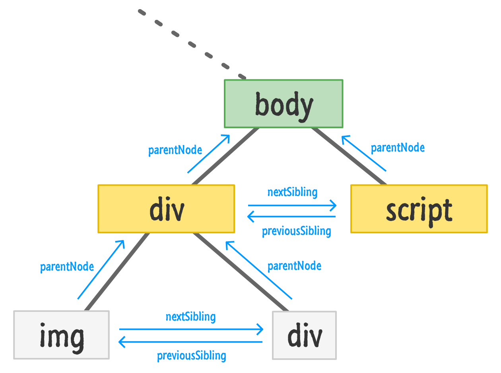
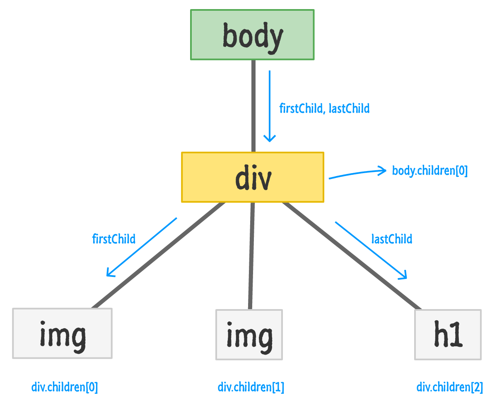

# DOM

- The **DOMContentLoaded** of **document** object event fires when your pages' DOM is fully parsed.
- The **load** event of **window** object fires once your page has fully loaded.
- Script can be loaded with **async** and **defer** attributes. For mote detailed information loo at [here](https://flaviocopes.com/javascript-async-defer/)

## Modifying DOM

- Use `textContent` to get or set text value of DOM element
- DOM elements have `setAttribute` and `getAttribute` methods to deal with attribute values of them.
- DOM elements have `firstChild`, `lastChild`, `parentNode`, `children`, `previousSibling` and `nextSibling` methods for familial roles.
- The `children` method returns a collection of the child elements. This collection is not an `Array`.

## Document Methods For Adding Elements

- Use `document.createElement` to create a new html element
- Use `appendChild` to append new html element to the DOM with some parent element. This methods append the child element to end of children elements.
- Use `insertBefore` to append new element before some other child element, not end of the children.
- If there is no pointed element as a second parameter of `insertBefore` method, then this method works as same as `appendChild` method.

## Document Methods For Deleting Elements

- Use `removeChild` to delete child nodes from parent node.
- User `remove` to delete node itself.
- When deleting a node, all the levels of children will be deleted as weel.

## Document Method For Cloning Elements

- User `cloneNode` to create new nodes that is identical to used one. It takes a parameter `true/false` to specify, whether clone children nodes as well.

Note: The text is wrapped by other nodes, and can be retrieved as `textContent` is actually child node of the wrapper node.

## DOM Sibling, Parent Relation Schema

## DOM Child and Children Relation Schema

