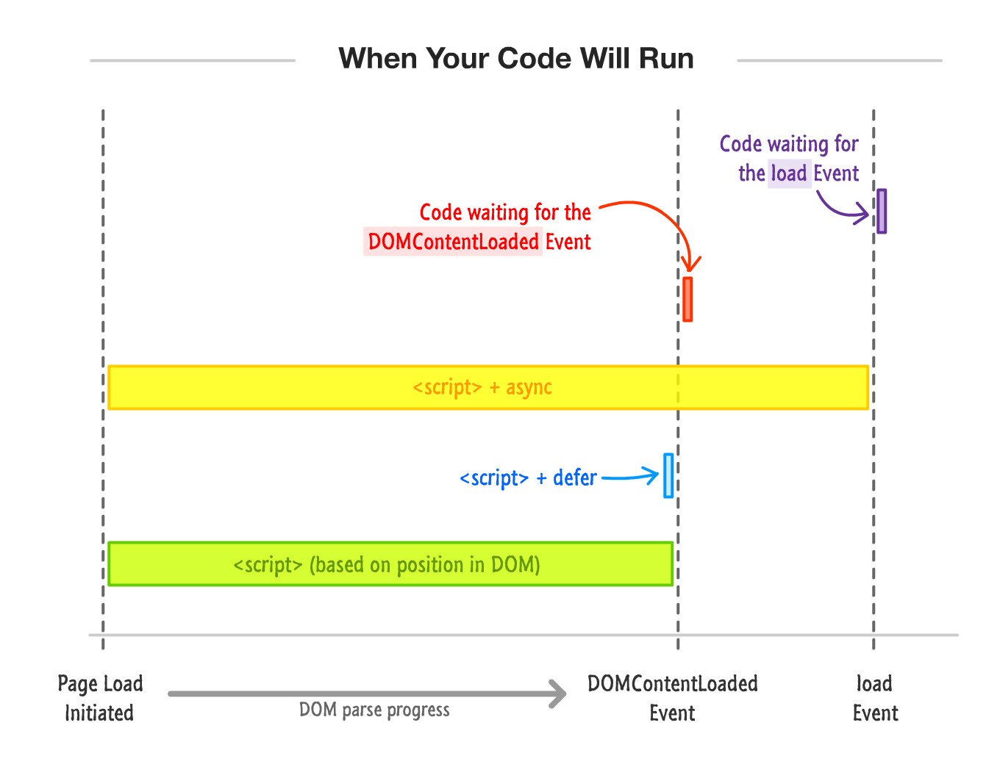

# DOM

- The **DOMContentLoaded** of **document** object event fires when your pages' DOM is fully parsed.
- The **load** event of **window** object fires once your page has fully loaded.
- Script can be loaded with **async** and **defer** attributes. For mote detailed information loo at [here](https://flaviocopes.com/javascript-async-defer/)
