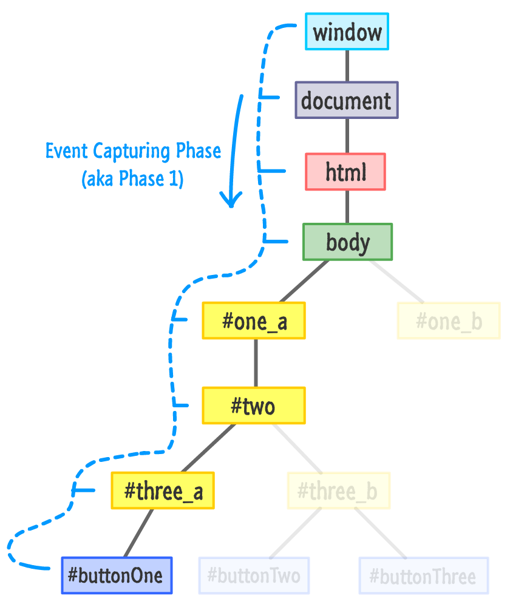
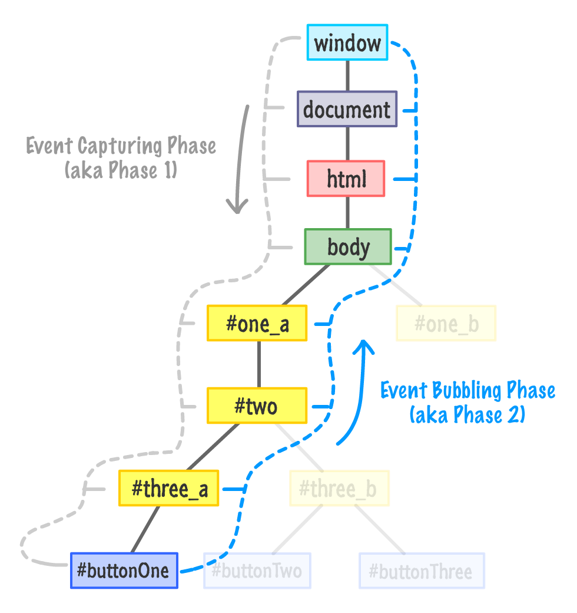
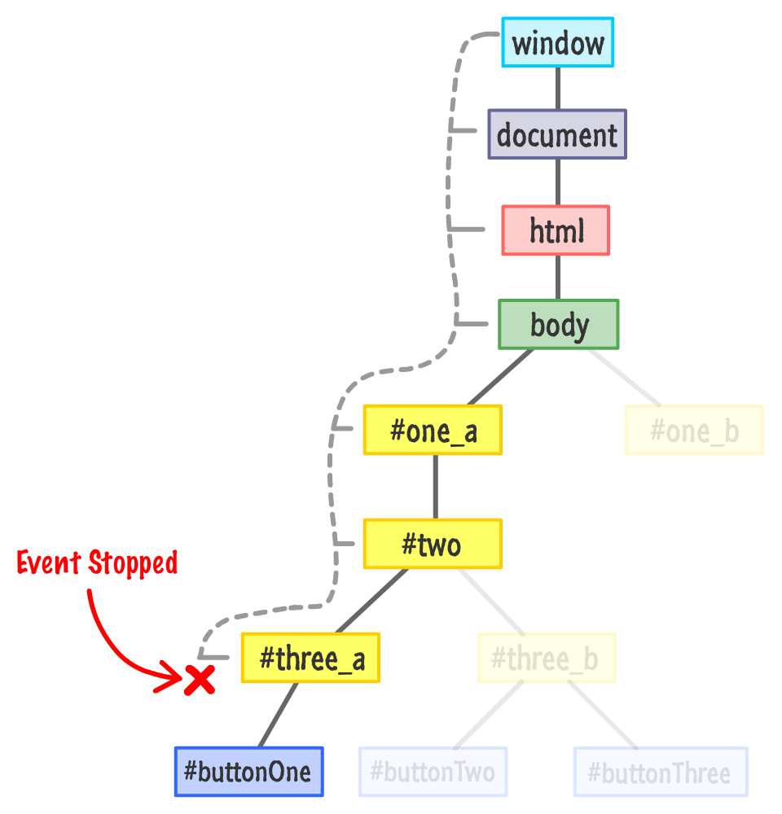

# Events

The common properties for different `Event` Types.

1. currentTarget
2. target
3. preventDefault
4. stopPropagation
5. type

## Adding Event Listener

The method is `element.addEventListener(event, eventHandler, useCapture)`

- event parameter is required.
- useCapture is optional.
  - When it is `true`, the handler is executed in the capturing phase.
  - When it is `false`, the handler is executed in the bubbling phase.

## Event Capturing Phase

When `buttonOne` element is clicked, event is captured by starting window element.

## Event Bubbling Phase

After `buttonOne` element capture the event, bubble phase starts.

## Event StopPropagation

`stopPropagation` method prevents our event from running through the phases.

## Event PreventDefault

- `preventDefault` method cancels the event if it is cancellable, meaning that the default action that belongs to the event will not occur

Note: Not all events are cancelable. Use the cancelable property to find out if an event is cancelable.

Note: The preventDefault() method does not prevent further propagation of an event through the DOM. Use the stopPropagation() method to handle this.

## Custom Events

- create new custom event with `new CustomEvent(eventName, eventDetail)`
- Dispatch the custom event from a DOM element, like `document.body.dispatchEvent(myCustomEvent);`
