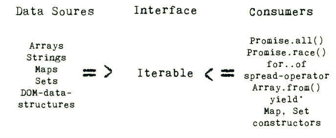

# Iterables

`Iterable`  — described by a data structure that provides a way to expose its data to the public. This is done by implementing a method whose key is Symbol.iterator. **Symbol.iterator** is a factory of iterators.

`Iterator` — described by a structure that contains a pointer to the next element in the iteration.

- Iterables are data structures which provide a mechanism to allow other data consumers to publicly access its elements in a sequential manner
- The concept of the iterable protocol can be split into the **iterable** (the data structure itself) and the **iterator** (sort of a pointer that moves over the iterable)
- `String`, `Array`, `TypedArray`, `Map` and `Set` are built-in iterables.
- Iterable objects can be used with using `loops`, `spread operator`, `Array.from` method, `destructuring` via an array pattern.
- Technically, iterables must implement the method named `Symbol.iterator`.
  - The result of `obj[Symbol.iterator]` is called an iterator. It handles the further iteration process.
  - An iterator must have the method named `next()` that returns an object `{done: Boolean, value: any}`, here done:true denotes the iteration **end**, otherwise the value is the next value.
- `Array.from`, ES6 introduced, helps us convert array-likes and iterables into real arrays
- The Symbol.iterator method is called automatically by `for..of`, but we also can do it directly.
- Built-in iterables like strings or arrays, also implement Symbol.iterator.
- Strings are both array-like and iterable, but strings are iterable over unicode points.
- Arguments are also iterable.



- An example of range iterable

```javascript
let range = {
  from: 1,
  to: 5
};

// 1. call to for..of initially calls this
range[Symbol.iterator] = function() {

  // ...it returns the iterator object:
  // 2. Onward, for..of works only with this iterator, asking it for next values
  return {
    current: this.from,
    last: this.to,

    // 3. next() is called on each iteration by the for..of loop
    next() {
      // 4. it should return the value as an object {done:.., value :...}
      if (this.current <= this.last) {
        return { done: false, value: this.current++ };
      } else {
        return { done: true };
      }
    }
  };
};

// now it works!
console.log([...range]); --> // 1, 2, 3, 4, 5
```

- Calling an iterator explicitly

```javascript
let str = "Hello";

// does the same as
// for (let char of str) alert(char);

let iterator = str[Symbol.iterator]();

while (true) {
  let result = iterator.next();
  if (result.done) break;
  alert(result.value); // outputs characters one by one
}
```

**Note**: There is a difference between Array-like and Iterable objects

- Iterables are objects that implement the Symbol.iterator method, as described above.
- Array-likes are objects that have indexes and length, so they look like arrays.
