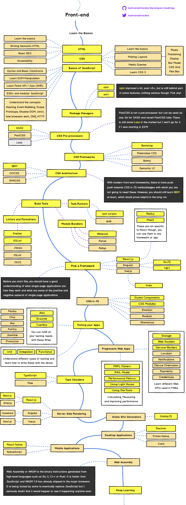

# Learning-notes

### Self Notes

- Javascript
  - [Getting Started](Javascript/README.md)
- Typescript
  - [Getting Started](Typescript/getting-started.md)
- CSS
  - [Getting Started](CSS/README.md)

### Clean Code

- [Clean Code slides](http://slides.com/bgando/clean-code-js#/)

## Front end Roadmap

You can find the related medium [blog](https://medium.com/@kamranahmedse/modern-frontend-developer-in-2018-4c2072fa2b9c)

